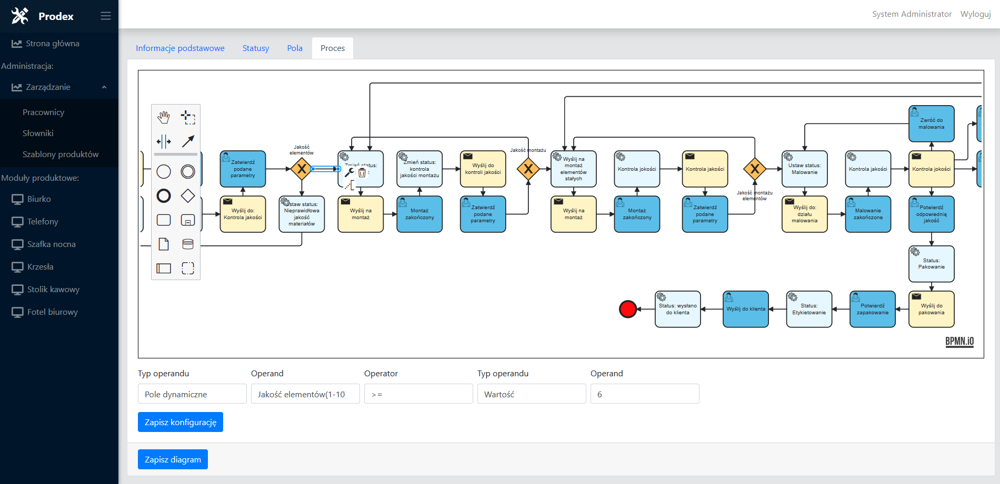

<h1 align="center">
   
  
   
   
  Prodex
   
</h1>

<h4 align="center">Web application for managing production proceses.</h4>

  <a href="#key-features">Key Features</a> •
  <a href="#credits">Credits</a> •
  <a href="#license">License</a>

    

## Key Features

* Managing workers
* Managing system dictionaries
* Creating and managing system modules
    - Define statuses
    - Manage data fields in produced items
    - Manage production process with simple bpmn diagrams  
* Work planning
* Live analizing and fixing issues in production processes

## Credits

This software uses the following packages:

- [bpmn.io](http://bpmn.io/)
- [MediatR](https://github.com/jbogard/MediatR/)
- [FluentValidation](https://docs.fluentvalidation.net/en/latest/#)
- [FluentMigrator](https://fluentmigrator.github.io/)
- [Blazorise](https://blazorise.com/)

## License

MIT
